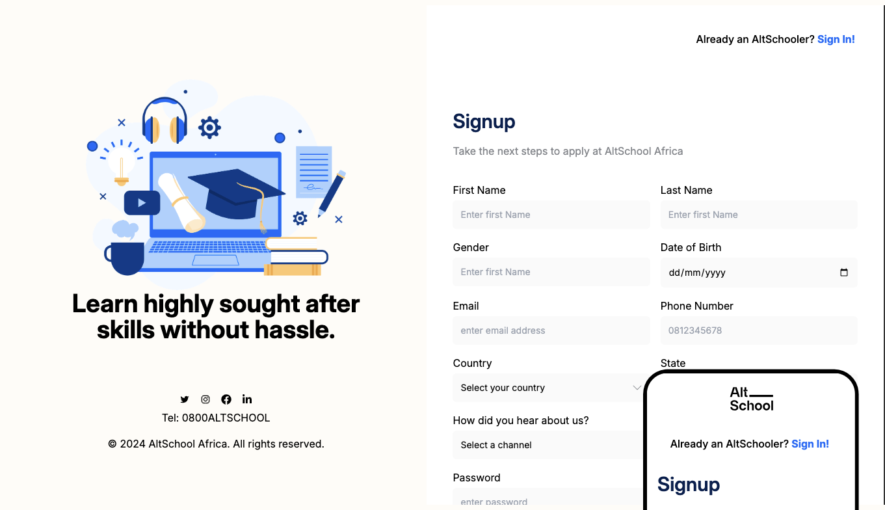

# AltSchool Africa SOE Karatu Semester Assignments

## Overview

Welcome to the repository of my completed Karatu Semester assignments for AltSchool Africa.

## Preview

_Figure 1: Application Form - This is a snapshot of the application form I built as part of Assignment 1, demonstrating clean design and intuitive user experience._

## Assignments

### 1. Personal Profile and Application Form

- A personal profile page with information about the student.
- An application form replicating the AltSchool Africa application process.

### 2. AltSchool Africa Course Table and Multimedia Page

- A table displaying all courses and schools at AltSchool Africa.
- A multimedia page showcasing various HTML media elements.

## Technologies Used

- HTML5
- CSS3

## Features

- Responsive design for various screen sizes
- Semantic HTML structure
- Accessible web components
- Interactive elements (where applicable)

## Setup and Usage

1. Clone the repository:
